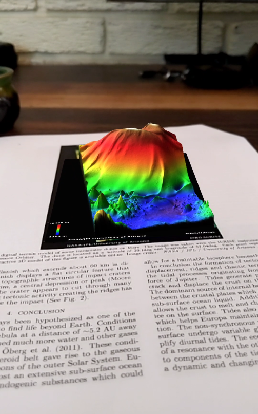

# Data-VisualizAR
Visualize 3D models (.obj) or data using augmented reality on your mobile phone through the web with [AR.js](https://github.com/jeromeetienne/AR.js)

- :iphone: Open this link on your phone [https://tinyurl.com/web-ar-obj](https://pearsonkyle.github.io/Data-VisualizAR/static/github.html) or use the QR code below

- :camera: Point camera at marker below 


## Web server
```python 
python web_ar.py
``` 

URL Paths: 
```
/
/model
/video
/models/<name>
/poly/<id>
```

## Features

Load models from google poly
`/poly/5NzgdDmbPwb`


### Web-VR Compatible


### Create Interactive Paper Plots


Tracking on an image such as a figure in a paper requires generating a feature set with this app: https://github.com/AR-js-org/NFT-Marker-Creator

For an html example please see: https://github.com/pearsonkyle/Data-VisualizAR/blob/master/static/index.html


### Create 3D models from videos on your mobile phone
Whether you're in the field or at home, the app [Display.land](https://display.land/) allows you to do photogrammetry from your mobile device


To view the model on the app: https://displayland.app.link/YC003lrn34

Download the model from google poly: https://poly.google.com/view/784CczTcxWX

And use it with this AR site! 