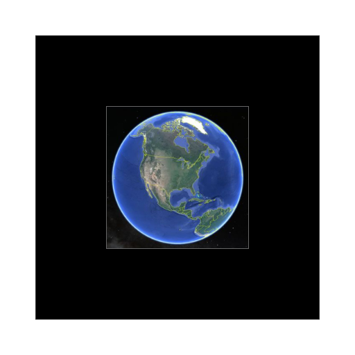
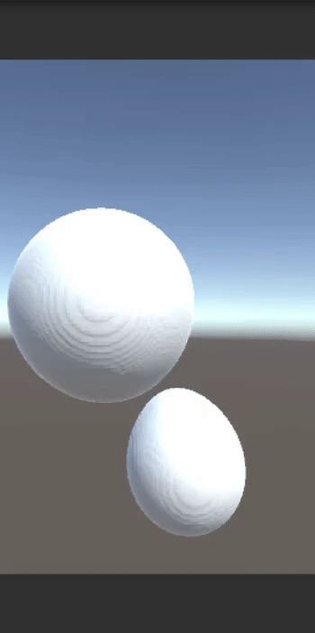

# Data-VisualizAR
Create and visualize 3D data and models (.obj) in augmented reality through the web with AR.js

- :iphone: Open this link on your phone [https://tinyurl.com/web-ar-obj](https://pearsonkyle.github.io/Data-VisualizAR/static/github.html)

- Point camera at picture below 



## Web server
```python 
python web_ar.py
``` 

URL Paths: 
```
/
/model
/video
/models/<name>
```

## Coming Soon
AR & VR visualizations of planetary collisions from SPH simulations 


